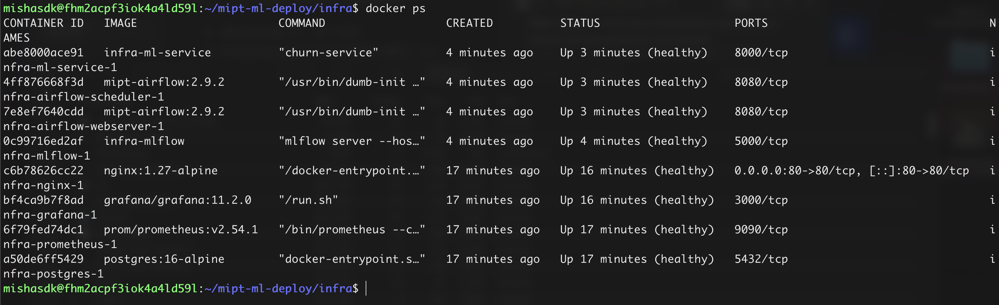

# Описание решения задания

## Шаг 1

Постановка цели содержится в [01-problem.md](01-problem.md) документе.

## Шаг 2 

Манифест ML-системы: [02-manifest.md](02-manifest.md).

## Шаг 3

Для декларативного описания инфраструктуры использовались:

- [terraform](../infra/terraform/) - для первичного создания VM и отчистки ресурсов;

- [docker-compose.yml](../infra/docker-compose.yml) - задает описание всех сервисов, которые деполятся в рамках единой VM.

## Шаг 4

Описание SLI/SLO по трём уровням (технический, модельный, бизнес) [03-sli-slo.md](03-sli-slo.md).

## Шаг 5

Решение по MDD: [0002-latency-improvements.md](adr/0002-latency-improvements.md).

## Сервисы

Все сервисы доступны через nginx-шлюз (порт 80) на `http://111.88.250.67` (до времени защиты).
Доступ под auth gateway, кроме Grafana и Airflow (своя авторизация).

| Сервис | Endpoint | Назначение |
|---|---|---|
| ML-сервис | http://111.88.250.67/ | API инференса |
| ML-сервис Swagger | http://111.88.250.67/docs | проверка API  |
| MLflow | http://111.88.250.67/mlflow | трекинг экспериментов и registry |
| Airflow | http://111.88.250.67/airflow | оркестрация обучения |
| Prometheus | http://111.88.250.67/prometheus | сбор метрик |
| Grafana | http://111.88.250.67/grafana | дашборды и алерты |

## Статус развёртывания

Контейнеры, запущенные на VM (`docker ps`):

